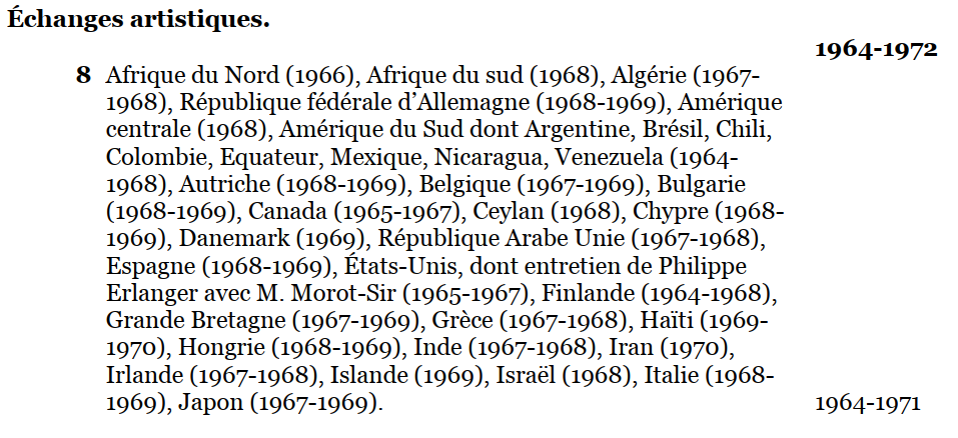

# GDA M1, 2020-2021, S2

## Préparer et analyser des données

### Objectifs
Proposer une analyse des données contenues dans l’instrument de recherche FRMAE 555 INVA, Direction générale des relations culturelles, scientifiques et techniques et Association française d’action artistique (1924-1973), à partir d’une question de recherche.

### Méthodes
- Identifier les données exploitables
- Les convertir en un format tabulaire pour une facilité de manipulation, sans pour autant perdre leur sens
- Analyser ces données au moyen d’outils statistiques et graphiques (2e partie du semestre, avec Giovanni Vitali)

### Etapes de travail
- Définir une question
- Analyser et mettre en forme les données existantes qui permettent de proposer des éléments de réponse à cette question (sur la base d'une version encodée en EAD de l'inventaire)
- Convertir les données dans un format plus facilement exploitable pour des manipulations ultérieures
- Documenter son travail

